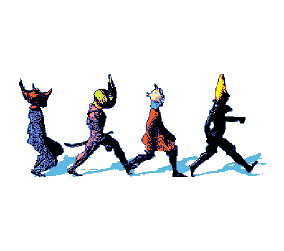

═══════════════════════════════════════════════════════════════════════

HEADER ─ Tu wordmark. Diséñalo a 880 px de ancho y exporta @2x
     (1760 px). Es el único sitio donde tu trabajo de diseño habla

<picture>
  <source media="(prefers-color-scheme: dark)" srcset="./assets/header-dark.png">
  
</picture>

<pre>
    DESIGN      UI · UX · Design systems · Visual identity
    CODE        Vue · JavaScript · Modern CSS · Figma to production
    FOCUS       Accessible interfaces with hierarchy that survives the build
    OPEN TO     My first Front-End / UI Developer role

GIF ─ Pequeño y centrado, como el de la referencia.

  

SKILL ICONS ─ Cambia la lista en AMBAS urls (dark y light).

<picture>
  <source media="(prefers-color-scheme: dark)" srcset="https://skillicons.dev/icons?i=figma,ai,ps,html,css,sass,js,vue,git,vercel\&theme=dark\&perline=10">
  
</picture>

  

ENLACES ─ Mismo neutro en los dos. El color lo pone tu header,

